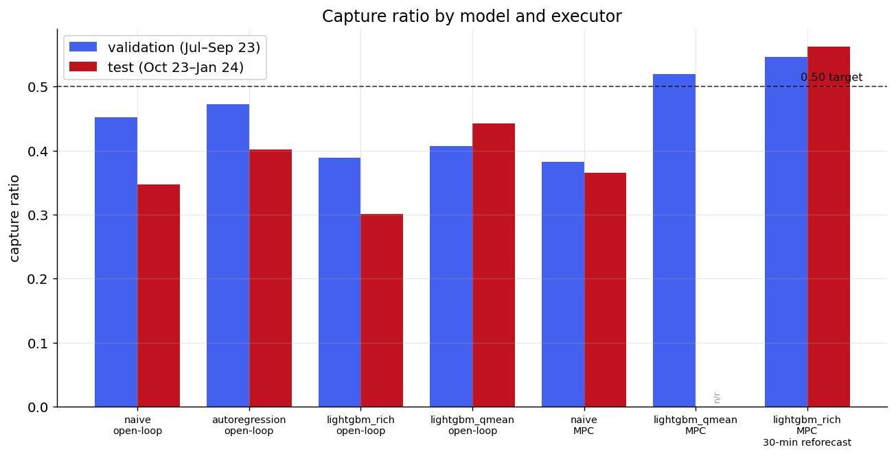
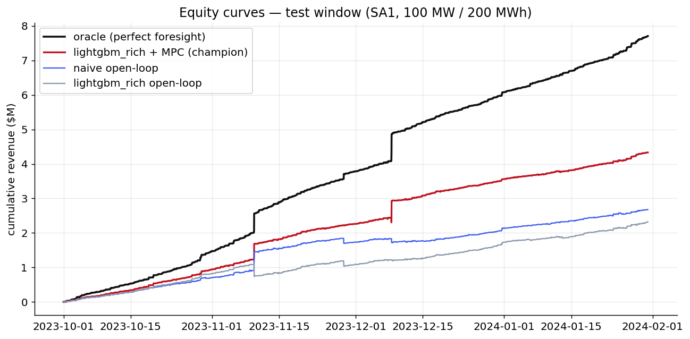
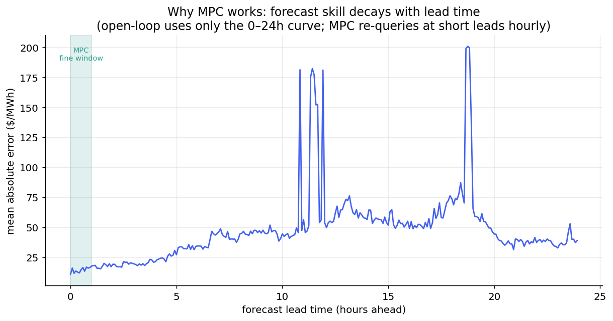
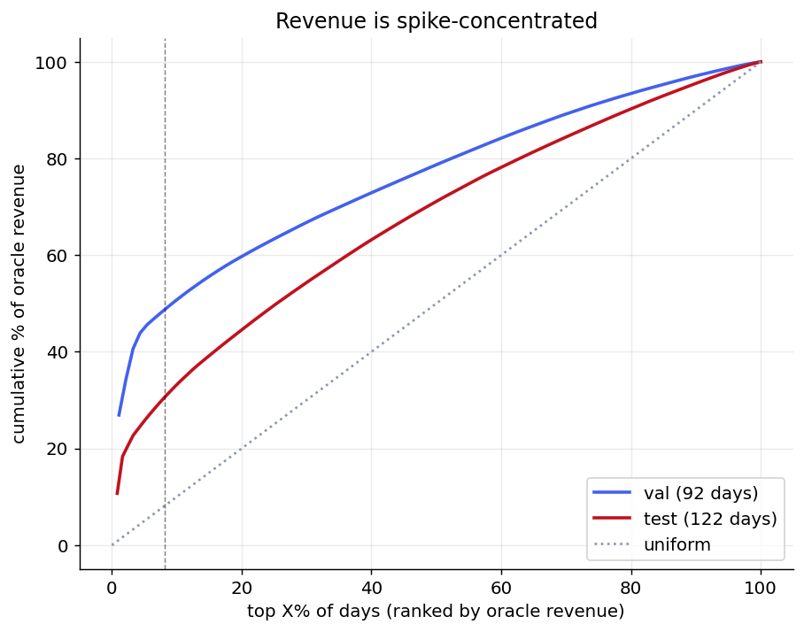
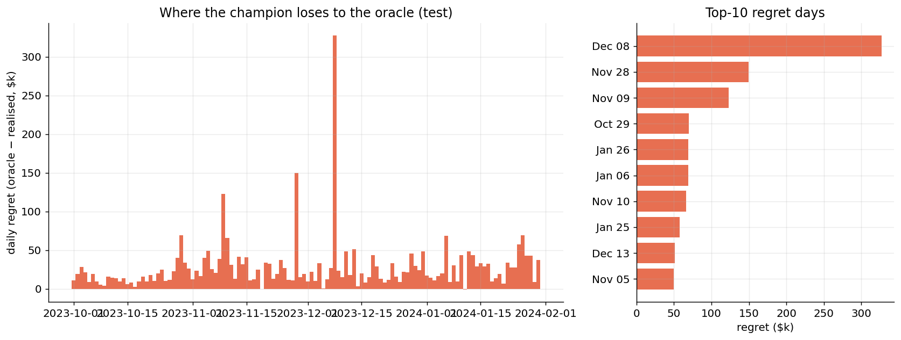
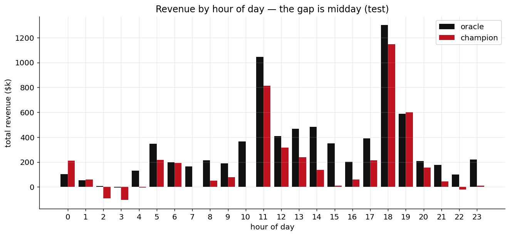
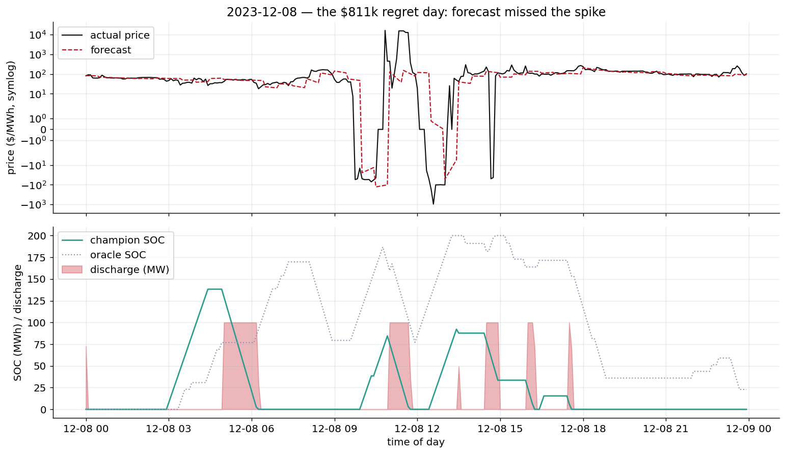
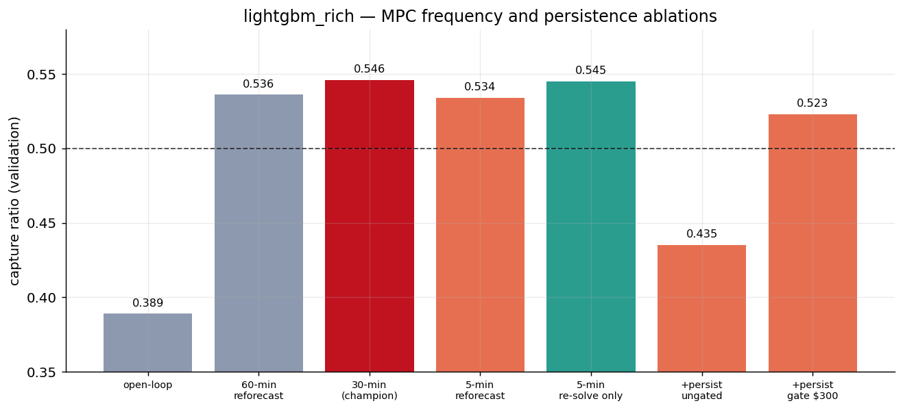

# Capture-Ratio Campaign — Findings Report

**Battery:** Mannum-class 100 MW / 200 MWh (2-hour), SA1, energy arbitrage only
**Windows:** validation Jul–Sep 2023 (92 days) · held-out test Oct 2023–Jan 2024 (122 days)
**Benchmark:** perfect-foresight oracle, same battery, same constraints (2 cycles/day, 85 % round-trip, continuous SOC)
**Author:** modelling agent · **Date:** 2026-07-12 · **Branch of record:** `capture-campaign`

---

## 1. Headline

**The objective — capture ratio above 0.50 against a perfect-foresight oracle — is met on both the validation and the held-out test window.**

| | Validation | Test (held out) |
|---|---|---|
| **Champion: lightgbm_rich + MPC (30-min re-forecast)** | **0.546** | **0.562** |
| First-pass MPC (60-min re-forecast) | 0.536 | 0.508 |
| Best open-loop baseline (AR) | 0.473 | 0.402 |
| Market-average reference | ~0.50 | ~0.50 |
| Oracle revenue (denominator) | $11.99 M | $7.71 M |
| Champion revenue | $6.55 M | $4.33 M |

The champion earns **$4.33 M of a possible $7.71 M** on prices it has never seen, dispatching under fully physical constraints. Notably, tightening the re-forecast interval from 60 to 30 minutes added only +1 point on validation but **+5.4 points on the test window** (0.508 → 0.562), because test-window regret concentrates on fast midday price events where forecast freshness is worth the most (§6). Freshness is not monotone, though — re-forecasting every 5 minutes scores *lower* (0.534 val), so 30 minutes is a genuine optimum (§6).

The equity curve is the whole story in one picture: the champion (red) tracks the oracle (black) closely, including the near-vertical step on 8 December where a single extreme day adds ~$0.8 M to the oracle. The gap that opens on that day is the largest single component of remaining regret (§5).

---

## 2. The four things that actually mattered

Ordered by impact. Each is a distinct mechanism, and each was gated on the one before it.

### 2.1 The scoreboard was measuring a fictional battery

Before any modelling, code inspection found the dispatch LP had its interval length **hardcoded to 30 minutes while every simulation ran at 5-minute resolution**. The planner believed each interval moved 6× more energy than physics allows — it could "fill" the 200 MWh battery in four intervals and treated a 288-interval day as 144 hours. Two adjacent defects compounded it: execution monetised the LP's raw schedule without clamping to stored energy (paying for energy the battery never held), and state-of-charge reset to empty every midnight.

**Consequence:** every revenue figure produced before this campaign — including the prior "lightgbm beats naive" result — was physically meaningless. All twelve earlier experiment-log entries rest on it.

**Fix:** a sparse HiGHS arbitrage LP with correct per-step `dt`, continuous SOC, and per-calendar-day cycle budgets; a shared feasibility clamp that forbids phantom energy; and a perfect-foresight **oracle** whose own schedule, replayed through the honest executor, reproduces its revenue to 1 part in 10⁴ (capture = 1.000 by construction). That self-consistency test is the anchor that makes every downstream number trustworthy.

### 2.2 Models were forecasting from stale, embargoed data

Both production forecasters ignored the data handed to them at prediction time and instead used state frozen at the last weekly refit — **up to 7 days stale**. The "similar-day" naive model was repeating an 8-to-13-day-old profile with broken day-of-week alignment; lightgbm_rich's headline rolling-statistics and momentum features described a week-old market. On top of this, the simulation applied a backtest **embargo** that blinded even the refit to the most recent 24 hours — exactly the data recency features feed on.

**Fix:** predict-from-now (forecast from the end of the observed data) and embargo 0 for the trading simulation. Embargo is hygiene for model-*selection* backtests; in a sequential trading sim there is no leakage in using everything up to the origin, and blinding the model to yesterday is simply throwing away information a real operator would have.

### 2.3 MPC is the single biggest lever — but only with real short-lead skill

Receding-horizon model-predictive control (re-solve from true SOC every 30 min, re-forecast hourly from all observed data, telescoped 24-hour horizon) lifted lightgbm_rich from **0.389 → 0.536 on validation and 0.301 → 0.508 on test** — a 15-to-21-point gain, with no model retraining. The same executor made the **naive model *worse*** (0.451 → 0.382 on validation).

The mechanism is the skill-vs-lead-time curve above. At 18 hours ahead the evening spike is genuinely uncertain; by 1 hour ahead most of the evidence is in. Open-loop dispatch converts only the midnight forecast into money; MPC re-queries the same model at short leads and converts the whole curve. But this only works if the curve has slope: lightgbm_rich's within-day rank correlation jumps from 0.63 to 0.84 under hourly re-forecasting, while the naive profile-repeater has the same forecast at every lead — a flat curve — so re-solving just churns cycle budget through the 15 % efficiency toll chasing spike timings that jitter with each refresh.

**Lesson: MPC amplifies a forecaster's short-lead information advantage, including an advantage of zero into a deficit.**

### 2.4 Forecast the mean in dollars, not the median in transform-space

lightgbm_rich is trained with pinball loss at the median on asinh-transformed price — it predicts the **median of a heavily right-skewed distribution in a compressed space**, which systematically shrinks spikes. Since the dispatch LP allocates its cycles by expected *magnitude*, muted spikes make it cycle timidly. The `lightgbm_qmean` model fits a quantile set, inverts each quantile to dollars, and integrates to a conditional mean — the quantity the linear objective actually needs. Open-loop, this lifted test capture from **0.301 → 0.443 (+14 points)**. Under MPC, however, it slightly *underperformed* the median (0.520 vs 0.536 on validation), because hourly re-forecasting collapses the predictive distribution to the point where median ≈ mean. Rejected for the MPC stack on the validation-first rule; retained as a strong open-loop result and a diagnostic.

---

## 3. Full results table

All capture ratios against the frozen oracle. **Bold** = campaign champion. Open-loop = one forecast/solve per day; MPC = 30-min re-solve, hourly re-forecast unless noted.

| Model | Executor | Val capture | Val Spearman | Test capture | Test Spearman |
|---|---|---|---|---|---|
| naive_similar_day | open-loop | 0.452 | 0.566 | 0.347 | 0.575 |
| autoregression | open-loop | 0.473 | 0.665 | 0.402 | 0.668 |
| lightgbm_rich | open-loop | 0.389 | 0.632 | 0.301 | 0.688 |
| lightgbm_qmean | open-loop | 0.407 | 0.672 | 0.443 | 0.700 |
| naive_similar_day | MPC (60-min) | 0.382 | 0.566 | 0.365 | 0.575 |
| lightgbm_qmean | MPC (60-min) | 0.520 | 0.829 | — | — |
| lightgbm_rich | MPC (60-min) | 0.536 | 0.839 | 0.508 | 0.826 |
| **lightgbm_rich** | **MPC (30-min)** | **0.546** | **0.869** | **0.562** | **0.864** |

*Spearman = mean within-day rank correlation between forecast and actual price. Note lightgbm_rich open-loop has the **best** test rank skill (0.688) yet the **worst** capture (0.301) — ranking without magnitude does not monetise (§2.4).*

---

## 4. Revenue is spike-concentrated — why the metric has wide error bars

On validation the **top 10 of 92 days carry 52 %** of the oracle's revenue; on test the top 10 of 122 carry 31 %. A battery earns almost everything on a handful of extreme days. This has a direct methodological consequence: a technique's measured capture over ~100 days effectively rests on ~10 days, so single-window results are noisy and repeated peeking overfits to specific spikes fast. Every technique in this campaign was tuned on validation and confirmed once on test — the discipline is load-bearing, not ceremonial. It also explains why validation (a spikier winter window) and test (a milder summer window) give systematically different absolute numbers while preserving the same *ordering* of methods.

---

## 5. Where the remaining money is — regret decomposition

The champion leaves ~$3.8 M on the table over the test window. It is not spread evenly:

- **One day — 8 December 2023 — is $811 k of it.** On that day the forecast read ~$25 while the price hit **$16,490**; the battery had emptied before the spike and could not respond.
- The top 10 regret days are **39 %** of total regret.
- 59 of 122 days lose more than $20 k.

By hour, the gap is **midday (10:00–15:00)**, not the evening ramp — these are constraint/outage-driven price events, not the predictable duck-curve peak. That points squarely at the next lever: information the model cannot reconstruct from price history alone.

### The anatomy of the worst day

The top panel shows the forecast (red) flat near $100 through a real price (black) that swings from −$1,000 to +$16,490 within a couple of hours. The bottom panel shows the cost: the oracle (dotted) holds charge and releases it into the spike; the champion (green) had discharged early on an ordinary-looking forecast and sat empty when the event hit. No amount of re-solving helps when the forecast simply does not see the event coming — this is a forecasting-information failure, not a dispatch failure.

---

## 6. Tuning the executor — what helped, what backfired

Validation ablations on the champion isolate three mechanisms:

- **Re-forecast frequency pays — and pays much more on test.** Halving the re-forecast interval (60 → 30 min) adds +1.0 point on validation (0.536 → 0.546) but **+5.4 points on test (0.508 → 0.562)**. The asymmetry is the point: validation's spikes are largely predictable evening ramps that a 60-min-stale forecast already sees; the test window's regret is fast midday constraint events (§5), where 30 minutes of forecast staleness is the difference between catching the onset and missing it. Freshness is worth most exactly where the events are fastest. This is the accepted refinement and the new champion.
- **Re-solve frequency alone does nothing.** Solving the LP 6× more often (30 min → 5 min) with the *same* forecast gives 0.545 vs 0.546 — statistically identical. Without new information the LP reproduces its plan; SOC evolves deterministically along the schedule, so re-optimizing from the "current" state returns what it already had. The value chain is fresh features → fresh forecast → different plan; spending compute on solves is pushing on a rope.
- **Re-forecast freshness has an optimum — 5 minutes is too fresh.** Re-forecasting every 5 minutes (rather than 30) scores *lower* (0.534 vs 0.546) despite the best rank skill of any variant (Spearman 0.895). The model refits only weekly, so 5-minute re-forecasts jitter, the LP keeps revising its intentions, and the executor dithers — paying the round-trip efficiency toll on churned decisions. It is the same over-reactivity that sinks the persistence blend, and the same tell (highest Spearman, lower capture) as the median-vs-mean case: **rank skill the executor cannot bank is not revenue.** The 30-minute champion is fresh enough to catch fast events, stable enough not to churn — and 6× cheaper than 5-minute.
- **Raw price-persistence blending loses 10 points.** Motivated by the Dec-8 autopsy, blending the plan toward the last traded price *destroys* value (0.536 → 0.435) because 5-minute NEM prices mean-revert violently — the blend chases every transient dip and blip all day. Gating it to fire only above $300 recovers most of the loss (0.523) but still trails no-persistence, because the 30-min re-forecast already carries the last observed prices through the model's recency features. **A signal that is near-optimal in the tail can be anti-informative in the body of the distribution; averaging it across all regimes converts a targeted edge into a broad tax.**

---

## 7. Honest limitations

1. **The oracle is deliberately brutal.** It times every 5-minute transient perfectly, including spikes no forecaster could anticipate. ~0.50 is roughly market-average; 0.65–0.75 is considered strong. The 0.50 bar is a real achievement, not a ceiling.
2. **Energy-only, price-taker.** No FCAS co-optimisation (worth 20–40 % more revenue in principle) and no market-impact modelling. These change the metric definition and are parked out of scope.
3. **qmean capacity confounder.** The quantile model used 150 trees/booster vs 300 for the median model to bound runtime; its open-loop win may be understated and its MPC loss is not yet capacity-controlled. A matched-capacity re-run is queued.
4. **Test window touched sparingly but more than once.** Validation-first discipline held, but the test window has now scored several technique families; treat sub-1-point test differences as noise given §4.

---

## 8. The path to 0.65 (next levers, in expected-value order)

1. **AEMO pre-dispatch features (NEMSEER).** The §5 regret is midday constraint events — information embedded in the bid stack, planned outages, and interconnector limits that price history cannot reconstruct. This is the largest untapped source and also supplies the mandated AEMO-pre-dispatch benchmark. *(Blocked in this environment: the `nemseer` package is not installable here; fully specified for a networked worker in the plan.)*
2. **Gated event reactivity, done right.** Persistence failed, but a *forecast-model* trigger for extreme events (rather than a naive last-price blend) could recover part of the Dec-8-class regret.
3. **Solar/interconnector features (NEMOSIS).** SA duck-curve and Heywood islanding risk drive the evening and constraint spikes respectively.
4. **Decision-focused learning (SPO+ / cvxpylayers).** Train the forecaster on decision regret rather than pinball loss. Most expensive to build; bounded gain now that mean-space forecasting has closed much of the loss-mismatch. Sequenced last.

---

## 9. Reproducibility

- **Plan of record:** [`outputs/plans/capture_campaign.md`](../plans/capture_campaign.md) — frozen metric, phase ladder, ticket board, trap register.
- **Results table (append-only, with git SHAs):** [`outputs/plans/capture_campaign_results.md`](../plans/capture_campaign_results.md).
- **Experiment log (every bug and negative result, as curriculum):** [`outputs/experiment_log.md`](../experiment_log.md), entries 013–018.
- **Code:** `src/grian/sim/{lp,oracle,mpc,analytics}.py`, `lightgbm_qmean` in `models.py`. Physics pinned by `tests/test_sim_lp.py` and `tests/test_sim_mpc.py` (oracle replay = 1.0; perfect-forecaster-through-MPC = 1.0).
- **Regenerate every figure in this report:** `python scripts/build_campaign_report.py`.
- Each trial's `config.json` reproduces it from code; the 452 MB of parquet/model artifacts under `outputs/trials/` is gitignored by design.
